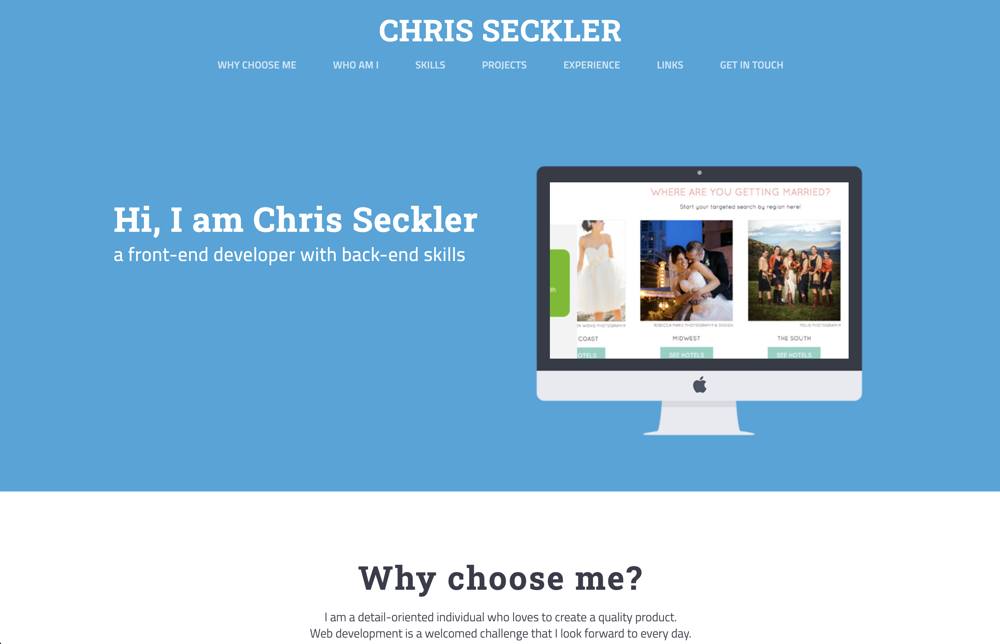
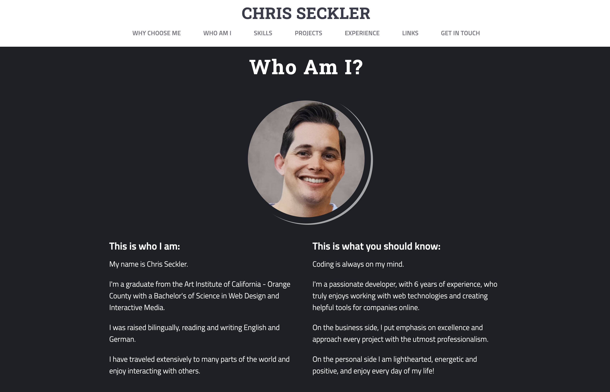
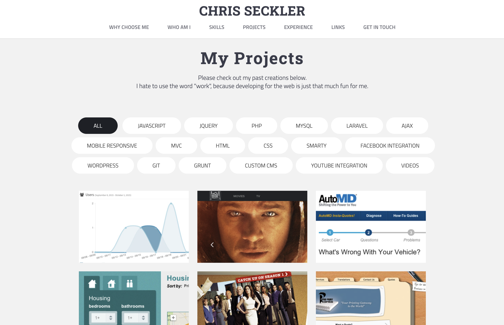
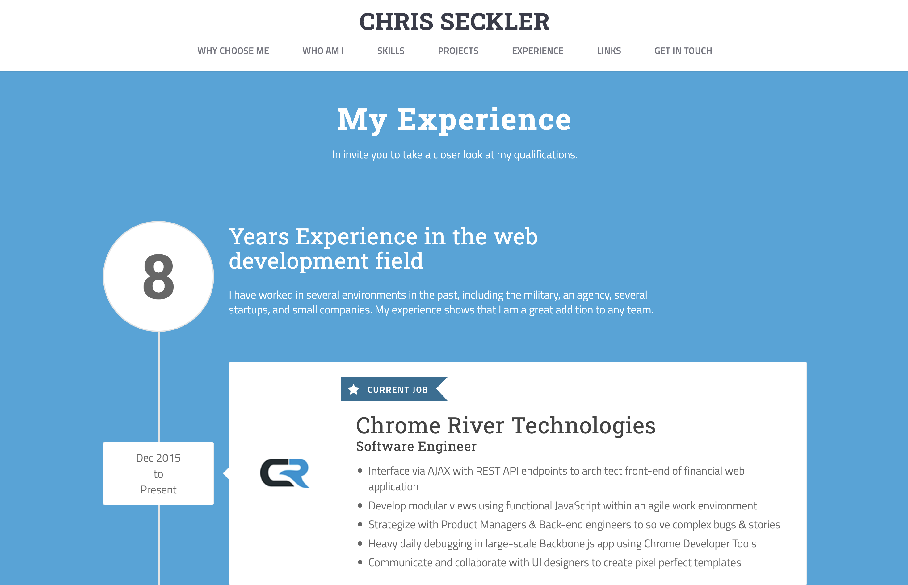
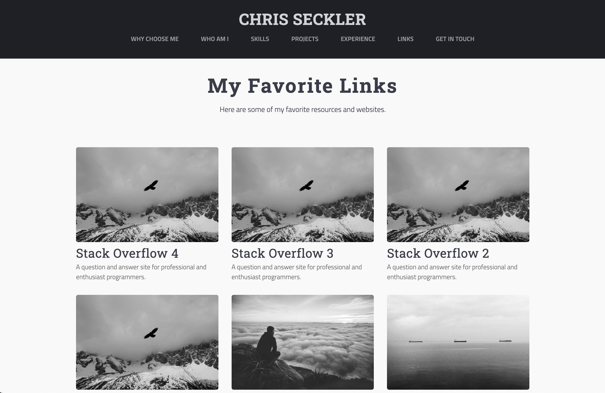

# Personal Portfolio Site

This is the repository for my personal portfolio site, built using HTML, CSS, JavaScript (Node.js), and the Nunjucks templating language.

## Features

- **Responsive Design**: The site is fully responsive, adapting seamlessly to various screen sizes and devices.
- **Templating**: Nunjucks is used as the templating engine to create reusable components and layouts.
- **Dynamic Links**: Links on the `/links` route are dynamically fetched from a Notion database.

## Notion Database Integration

The links on the `/links` route are fetched directly from my Notion database. You can view the database at the following URL:

[Personal Links - Notion Database](https://www.notion.so/cseckler/Personal-Links-f43d6ab01bfa401295e5a28fa4789166)

This integration allows for easy updates to the list of links by simply modifying the Notion database.

## Deployment

### Automatic Deployment to Vercel

The site is automatically deployed to Vercel whenever changes are pushed to the `main` branch. This ensures that the latest version of the site is always live.

### Local Development

To run the site locally, use the following command:

```bash
nodemon --exec vercel dev
```

This command will start the local development server, ensuring that the environment mirrors the production setup as closely as possible.

## Images






